# 机械组日常软件安装与配置

- 请逐字认真阅读本文档和链接文档，并按照文档中的步骤安装配置软件
- 文档中 ``SolidWorks、CAD、CAM`` 三个软件的安装包因体积过大，并未随文件压缩，可以找队里任何一个学长要
- 如果有错误，欢迎指正，不足之处，欢迎补充


- 2024-07-21 文档基本完善 确定奥松板功率和速度

----


## SolidWorks

- 微信公众号搜索：软件管家，输入 SW 获取。注意版本为2024。
- 严格按公众号内教程安装即可。必须严格按步骤安装，特别注意关闭防火墙的部分，必须确保全部关闭。

### 插件（选装）

- 大工程师，麦迪工具集等，自行搜索安装。
- 其中大工程师的非标零件绝大部分不让直接下载，不太推荐，齿轮插件导出后在三轴上面不能用，不推荐
- 麦迪工具集国标零件非常全，推荐
- 齿轮生成用``GearTrac``，目前暂时没发现有大问题，缺点是只能生成齿轮/涡轮类零件，推荐

------


## AutoCAD

- 微信公众号搜索：软件管家，输入 CAD 获取。版本任意。

- 严格按公众号内教程安装即可。同SW。


-----


## 大工程师 / MISUMI / 怡合达（单选或多选）

- 此类为辅助设计软件，有丰富的标准件库供使用。自行搜索安装。
- 大工程师不推荐，原因同上
- MISUMI因为是日产软件，所以用的东西有一部分没有
  - 气缸可以用[亚德客官网]()弥补，优点是在线预览和无限制下载，模型全面，队里面用的气缸都能找到，缺点是网站比较绕，很容易找不到在哪下载
  - 轴承类可以直接去淘宝上面找规格，找商家要模型或者直接自己简单建个模，只要满足尺寸关系和配合关系就可以了
  - 大多数非标零件都可以用以上的方法找到零件图或平替

- 怡合达国产软件，零件全，推荐

-----


## ArtCAM

- [安装包](./software/)，附安装教程。或微信公众号搜索：软件管家，输入 CAM 获取。版本任意。

### 配置软件

1. 软件安装成功后，打开软件，点击 ```新的模型-确定```（不用改任何东西，默认即可） 或打开任意 ``*.dxf`` 文档，按图操作：

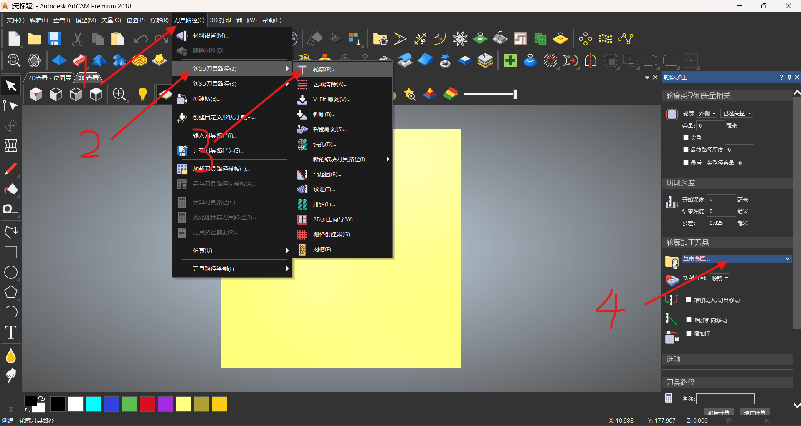

2. 在弹出的窗口中选择 ```增加组```，名称任意，例如 practical，在新建的组中单击 ```增加刀具```，增加以下两个，``行距`` 仅修改 ``%直径`` 为 33 即可，尺寸自动计算得出，```描述``` 的含义为 ```刀具直径-板厚```

   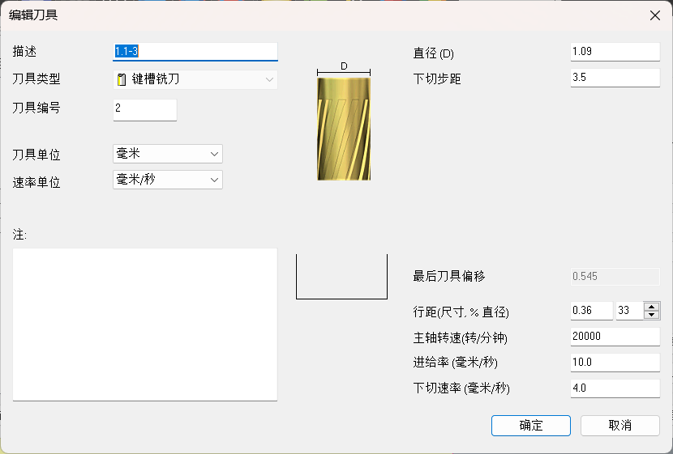

   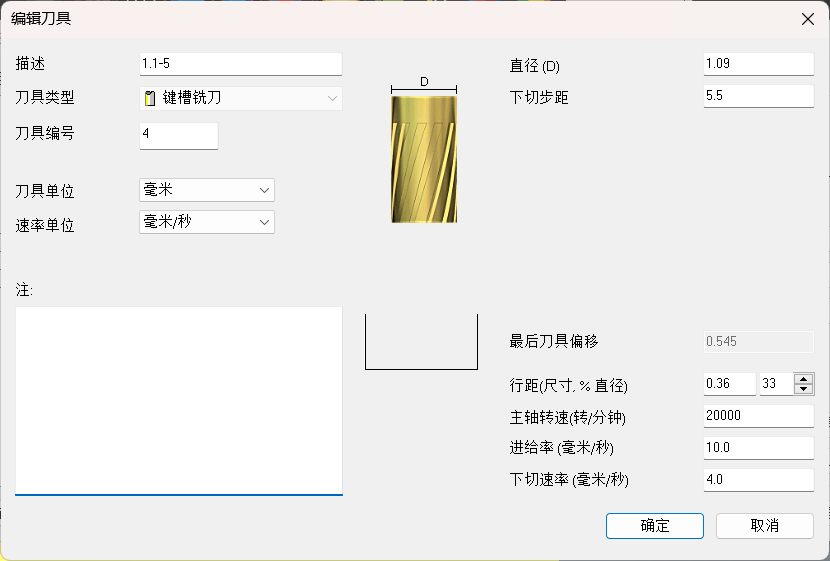
   
3. 至此软件配置完成

### 雕板 [附视频教程](./三轴视频/)

0. 打开雕刻机电脑，打开雕刻机，打开水冷泵（雕刻机后方） <b style="color: red;">进行下面的步骤之前确保自己已经按照[以上步骤](#配置软件)配置好了软件，如果没有，不应该进行下一步</b>

1. 打开要雕的 ```*.dxf``` 文件，**记下要雕板的尺寸**，点击 ```矢量诊断-开放-闭合-查找```，若左侧模型出现错误标记，在 CAD 中仔细检查确定无误后重复上述步骤，直到不再出现错误标记。(SW 直接导出的文件一般不会出现错误，如果出现错误，可以尝试重新导出)

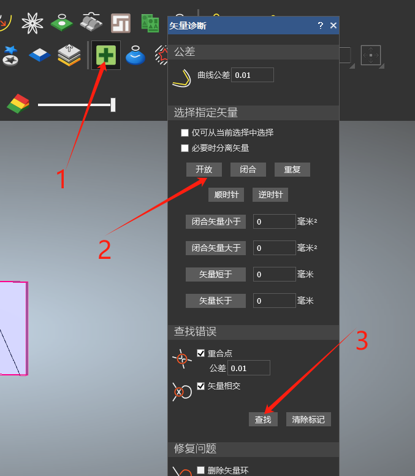

2. 设置图形原点 。点击``模型-设置位置-左下部像素点``，将xyz三个坐标的值都设为0，点击确定

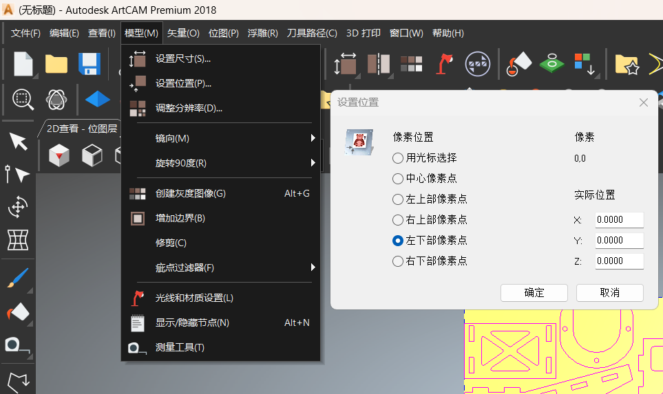

红/绿色交叉坐标系在整个图形的最左下角即为成功

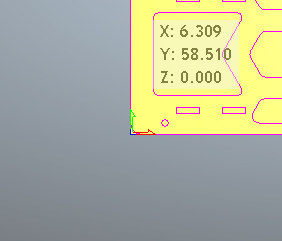

3. 设置材料厚度。

每次雕板前根据要雕的板厚设置材料厚度，

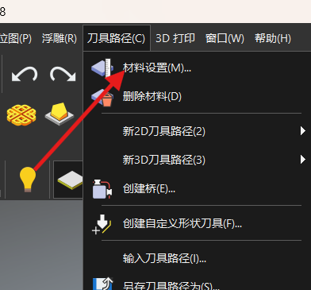

| 玻纤板厚度(mm) | 设置的材料厚度(mm) |
| :------------: | :----------------: |
|       3        |        3.2         |
|       5        |        5.2         |

4. 导出雕刻路径。

点击``刀具路径-新2D刀具路径-轮廓``，点击“轮廓加工刀具”中的单击选择，选择[软件配置](#软件配置)中新建的刀具，一般为 ``1.1-3``，依次点击下方“刀具路径”中的```稍后计算-现在计算``` 

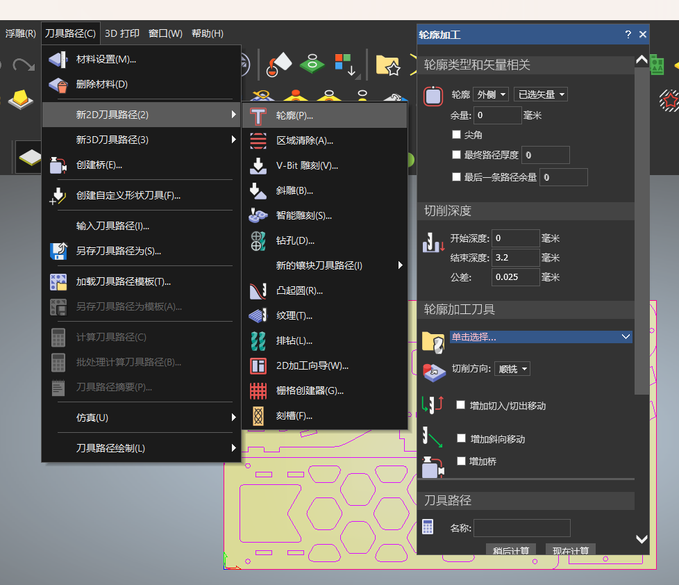

点击上图``刀具路径-另存刀具路径为``，更改保存路径，文件名称和文件格式，把文件保存在U盘中，**注意 机床文件格式为：Camtech RESIN CMC3 MM(\*.nc)**


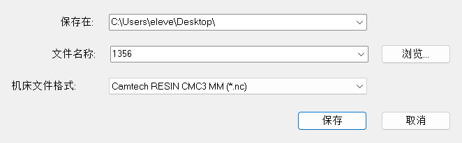

点击保存。

5. 雕刻。

用U盘把保存的 ``*.nc`` 文件复制到**雕刻机电脑**桌面，打开雕刻软件 ```NcStudio```，点击```文件-卸载-打开并装载```

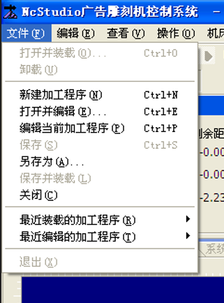

选择刚刚保存的文件，注意右下角的文件格式选择，右键右侧的``手动-编辑``，在左侧弹出的窗口中修改G-code，第二行改为 ``G9S20000``，并且删除最后三行，右键，保存并加载。

在板子上量取足够的尺寸（与第一步记下的尺寸比较），划定一个矩形区域。

根据需要调整进给度为``50%-70%``，主轴转速 ``20000``，使用右侧的 `手动` 模块，调整前后左右方向（XY方向）把刀大致对准矩形区域的左下角，打开 ``主轴旋转``，待达到额定转速后，用 ``0.5mm`` 的步进距离调整z轴位置，至到刚好接触到玻纤板表面 ( 声音变化 ) 后，用 ``0.1mm`` 的步进距离向下调整**0.6-0.7mm**，点击``工件坐标``归零坐标原点，点击 ``开始雕刻``。(形似播放按钮)

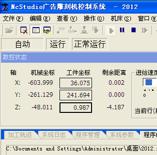

### 注意

1. 长时间雕刻请检查水冷桶内的水温，温度过高需更换凉水。

2. 保证板子无鼓包，无松动，无灰尘。

3. 三轴在进行长距离不抬刀的连续路径时，由于切割开两块板之间没有支撑，会有跳刀的风险，如果出现，及时调整夹具，压或者夹好板子。

4. 雕刻本着不浪费的原则，尽可能合理排版，不要浪费板材。

5. 建议图纸使用 sw 的```导出dxf``` 功能导出，直接在CAD中绘制的图纸会有大概率会出现问题。

6. 吸尘器用完记得清洗


-----


## 3D打印机（A8S/E8）

### PC端

1. 下载切片软件 [ JGCreate ](./Software/) (推荐) 或[ UltiMaker Cura ](./software/)，两个软件都在 ```./software/``` 目录下，链接打不开的去文件夹里找，本文以 ```JGcreate``` 为例。

2. 双击运行，一路下一步，直到选择安装路径界面。选择目标安装路径，例如将C改为D。

   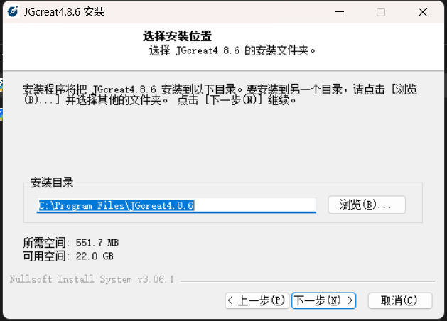

3. 一路下一步直到安装完毕。

4. 运行软件。首次使用需要添加打印机，在弹出的添加打印机界面选择A8S/E8，单击NEXT。

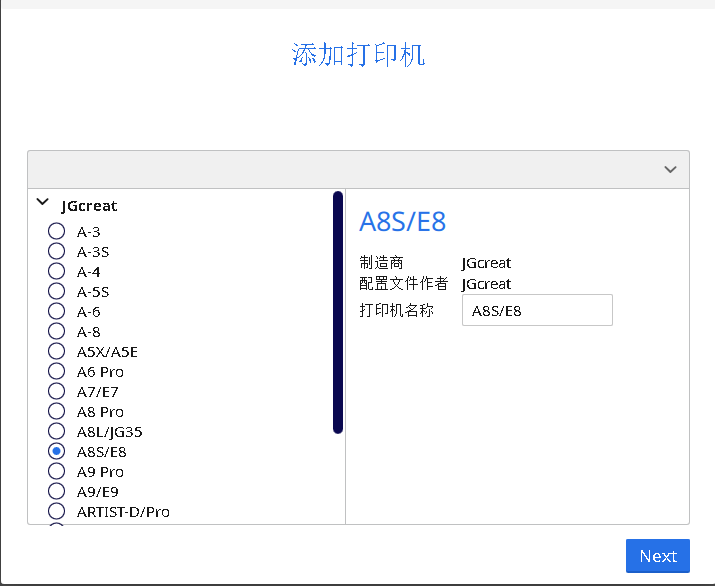

5. 默认打印耗材为 ```PLA```，依据实际使用情况更改。在右侧 ```打印设置``` 中单击 ```自定义```，更改为 Expert 模式

   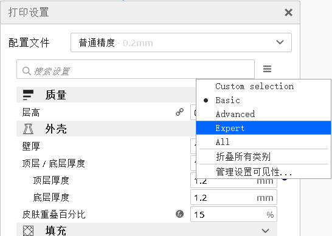

   对打印参数做以下更改（以下参数只针对PLA），其中熨平速度由软件计算得出，不用设置；填充密度根据打印件的受力要求动态调整，填充密度越大，强度越高；填充图案和支撑图案的 grid 为网格；Raft留白为3-5mm。

   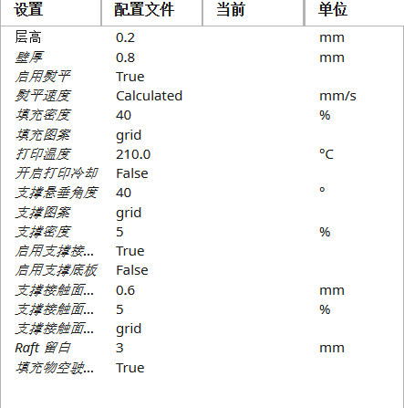

   其余保持默认。

6. 打开已经[处理好](#操作规范[1])的要打印的零件(```*.stl``` 格式)，选择适当的摆放方式，推荐 ```右键-编位所有模型``` 后微调，尽量减少支撑结构的生成，单击右下角的 ``切片`` ，单击预览，拖动右侧进度条，确认无干涉后保存在打印机U盘中。

7. 打印机U盘存储路径中不可以出现中文。命名文件格式最好为 ```hhmm-g.gcode```，例如切片软件中预测打印时间为6小时54分，需要耗材123g，则打印文件命名为 ```0654-123g.gcode```，方便了解打印进度。

### 打印机端

1. 打开打印机背后的电源，插入U盘。
2. 单击 ```调平``` 由左上到右上四点逆时针依次调平，以调平卡在挤出头与热床之间的缝隙活动有轻微阻力为准。
3. 单击 ```打印```，选择要打印的文件，单击 ```开始``` 按钮，等待热床和挤出头到达预设温度自动开始打印。

打印机菜单树结构如下

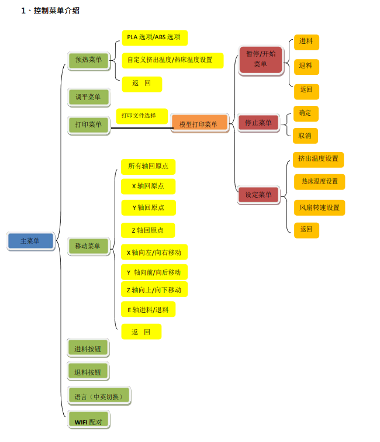

### 异常情况处理

#### 更换耗材

1. 打开新耗材，剪掉料盘开始的被折弯的一段，防止堵塞耗材管，在时间允许的情况下，最好把上一卷耗材最后一段也剪掉。
2. 插入新耗材，单击```暂停/开始菜单```中的 ```进料``` 按钮，等待进料完成（机器会先预热再进料，不要着急），确保挤出顺畅后继续打印。
3. 其他问题见 [打印机官方文档](./打印机官方文档/)    

-----

## 3D打印机（X1CC）

- 参数待定

----

## 可选软件

### localsend

- 文件传输软件，在局域网内可以跑满带宽。但是由于rc和rm都在的时候人数过多，校园网带宽可能已经被占满了，不推荐使用。一定要使用的话可以两个人(或多人)一起链接 ```KD_Robot_2024(或2023)_5G``` （出于某些原因这个WiFi的互联网功能已经停用了，但是局域网还是可以用的）带宽大概可以到二十几兆每秒，不太香，如果有USB3.2的U盘更推荐使用

### typora （推荐）

- 使用此软件要有一定的 ```markdown``` 语法基础，不过只用这个软件看文档也是不错的，会比导出后的PDF文档方便很多。

- 软件可以从[队内NAS](./队内存储NAS使用指南.pdf) 中获取，文件位置 ``./Software/typora-setup-x64.exe``，或在 [官网](https://typoraio.cn/) 下载。

- 破解教程：[破解/激活 Typora 2024 教程_typora激活方法-CSDN博客](https://blog.csdn.net/qjkewdmgkq/article/details/139335063) 文档中关于替换部分的字符要注意标点符号，标点<b style="color: red;">全部为半角</b>。


----


# 队内机械操作规范


- 在原有文档基础上有增改

## 钻床

### 操作规范

1. 钻床使用前请固定好需要打孔的零件，固定时确保零件与虎钳顶面水平，可以使用夹具或者自制夹具用来定位保证加工精度。
2. 固定好零件之后摇动X轴，Y轴手轮对齐空位，轻转Z轴手轮让钻头接触到零件表面来检查是否对齐。
3. 转动红色旋钮至**低速反转**，转动Z轴手轮打孔。
4. 打完孔后及时清理碎屑。

----


## 3D打印机

### 操作规范[1]

0. 本节针对JGMaker A8S/E8 打印机

1. 3D打印机耗材比较昂贵，使用时应尽量避免浪费。
2. 详细教程参照[3D打印机（A8S/E8）](#3D打印机（A8S/E8）)。
3. 绘图时应注意控制3D打印机的误差，理论值在0.2MM左右，尤其在过盈配合和间隙配合时。将孔直径扩大0.4mm(根据公差要求动态调整)，另存为 ```*.stl``` 发给打印机负责人进行打印。
4. 使用前发现美纹纸有破裂应及时更换（美纹纸属于消耗品）。
5. 打开打印机， <b style="color: red; ">调平后</b>选择打印，选择需要打印的文件名，点击打印。
6. 打印机会先预热，然后开始打印。

### <b style="color: red;">注意事项</b>

1. 打印前务必在切片软件中选择正确的打印机！别拿着A6的文件去A8上面打印！X1CC的在 ``bambu studio`` 里面切片，别混用，水平还没到那
2. 打印之前必须调平！！！！！！！！！！！！！！！！！！！！！！！！！！！！！！！！！！！！！！

----


## 切铝机

### 操作规范

0. 切铝机属于一类危险工具，使用时必须注意安全，使用前佩戴护目镜。严格按照规范操作。<b style="color: red; ">未经培训严禁进行任何操作。</b>

1. 使用夹具夹紧铝材。所需铝材过短时可以选择用另一根铝材抵住尾端并夹紧，以铝材不会飞出为准。

2. 不按动任何开关，下压切铝机观察是否存在偏差。切铝机锯片左侧应与铝材所画标志线有0.5mm左右的距离。

3. 按动大开关的同时按动切铝机的小按钮，<b style="color: red;">待切铝机达到额定的转速后!!!</b>下压开始切割。

4. 使用时另一只手切忌触碰铝材，靠近切割机刀片旋转范围，切割时保护罩会自动下落，<b style="color: red; ">切忌使用手去扶保护罩</b>。

5. 下压完全穿透铝材后，松开开关，<b style="color: red; ">待刀片完全停止旋转!!!!!再抬切割机</b>。（直接上抬会导致转速不够而崩坏刀片）。

6. 切割完成后，清理碎屑。

----


## 切割机/云石锯

### 操作规范

0. 切割机属于实验室一类危险用品，使用时务必注意安全。

1. 使用时佩戴护目镜，<b style="color: red; ">不允许佩戴手套</b>操作。使用前务必固定好板材。

2. 将需要切割的板材置于平台上，需要切割的地方悬空，观察保证切割机刀片不要接触到地面。

3. 悬空启动切割机，<b style="color: red; ">一定要拿稳</b>，等待达到额定转速。

4. 使切割机的平板靠着板材表面，小角度下刀开口。

5. 匀速推动切割机前进，尽量使切割机的行进路径为直线，避免产生夹刀。<b style="color: red; ">严防切割机跳刀，严禁在板材没有切割完之前关闭开关。</b>

6. 使用结束后，松开开关空转，待刀片完全停止旋转的时候，断开电源。

----


## 角磨机

### 操作规范

0. 角磨机属于实验室一类危险工具，使用时务必注意安全。使用前佩戴护目镜。
1. 使用前夹好切割物品，防止松动。正确选择切片和磨片，<b style="color: red; ">严禁混用</b>。
2. 一手<b style="color: red">拿稳</b>切割机，一手插上插销（防止上一个人没有关闭开关直接拔下插销，导致插电旋转，造成危险）。
3. 切割时匀速前进，严禁大角度90度下刀，防止产生危险。不要站在刀片旋转方向的切线方向。
4. 使用结束后关闭开关在拔下电源。

<b style="color:red;">！注意！！</b>

1. <b style="color: red;">！注意：任何时候严禁单手操作！！！</b> 
2. 更换磨片注意不要过于用力拧紧，牢固即可

3. 磨时注意不要蹭到中心的旋转轴。

----


## 手电钻

### 操作规范

1. 使用前插入电源（直插电源式）
2. 使用时注意转动方向，按动扳机电钻旋转，一般不会用到锁定按钮，所以别按 : )
3. 使用后记得拔掉电源

### <b style="color:red;">注意事项</b>

1. 手电钻使用时应注意安全。

2. 夹紧/松开钻头前必须拔掉电源，防止误触扳机发生危险。钻头一定要拧紧。

3. 直接插电源的手电钻禁止使用如下方式夹紧披头或拧松。

   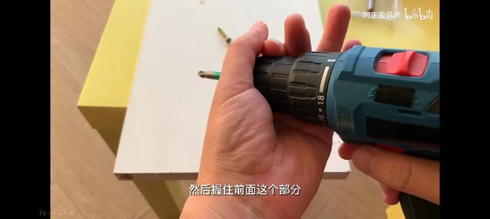

----


## 激光雕刻机

### 操作规范

1. 打开紧急开关（红色的，在冷却机后边，一般不会关，没电的话，检查实验室门口电闸），打开电脑。

2. 选择雕刻的 ```dxf``` 文件，直接双击打开，右边调节功率50 50，速度15 （根据不同批次的木板动态调节，功率和速度都不固定）。

|         椴木板          | 速度 | 功率 |
| :---------------------: | :--: | :--: |
|     椴木板（动态）      |  50  |  50  |
|   欧松板（基本固定）    |  5   |  50  |
| 1/0.5mm玻纤（基本固定） |      |      |

3. 单击 ```下载```，保存文件名为当前时间（或自定），快捷键bb，第一个候选词为当前时间，文件名不可以有中文。

4. 到激光雕刻机选择 文件-浏览，找到你要雕刻的文件（一般是第一个），点“确定”。

5. 按方向按钮，移动雕刻头到原点位置（原点为你图上的左上角），点击“定位”，点击“边框”，浏览有没有越界或者干涉。

6. 盖上雕刻机盖子，点击 ```启动/开始```。

### <b style="color:red">！注意！</b>

1. <b style="color:red">雕刻时，严禁将身体任何部位伸进雕刻机内部（激光为不可见光，以免对身体造成伤害）！</b>

2. 保存文件时选择 ```dxf``` 格式，为保证兼容性，选择最后一行的 ```dxf``` 版本。

3. 如果冷却机一直报警，及时上报。 

4. 激光雕刻机的头一般是调好焦距的，一般不要动他。

5. 雕刻本着不浪费原则，必须**合理排版**，不要浪费板材。

### 维护和维修

#### 光路

- 三面反射镜定期清洁，用75%的医用酒精和棉棒擦拭，把烟油擦干净之后用纸巾擦干
- 重新对光路
  - 一反：多撕几层纸胶带，贴在二反上，把激光头调到最左上角，点射，再调到最左下角，点射，如果两次点射的光点重叠，调二反（为了保证一反的光路正确，减小调节的工作量），如果两次点射光点不重叠，拧一反后面的调节螺母，往哪边偏就拧哪个螺母，直到光点重叠。
  - 二反：把纸胶带粘在三反上，最左点射一次，调到最右，点射一次（上下不做要求），调节方法相同，往哪边偏拧哪个螺母，直到光点重叠。
  - 三反：把纸胶带粘在激光头上，用力按几下按出轮廓，点射，把胶带尽量不旋转的揭下来，看光点往哪边偏，拧相反方向的调节螺母，直到光点在激光头轮廓的正中间。

#### 焦距

- 焦距尺，不太好用了
- 找一块废板放在激光头下面，用手把激光头调到最上面，点射，一点一点的往下调，直到在木板上打出的**光点最小**，拧紧激光头

### 异常处理

#### X轴越界

- 检查雕刻头右侧空间是否小于图上的尺寸，如果是，左移雕刻头，重新定位走边框；如果不是，拧钥匙关掉雕刻机，手动把激光头移到最右下角，打开雕刻机，等雕刻机复位完毕

#### 参数正确但木板不透

- 检查木板是否平整，[检查焦距是否正确](#焦距)，检查木板，雕刻 ``功率速度矫正-XX板.rld`` 文件（雕刻机电脑桌面），选择合适的功率和速度

| 椴木板                                                       | 奥松板 |
| :------------------------------------------------------------: | :------: |
| 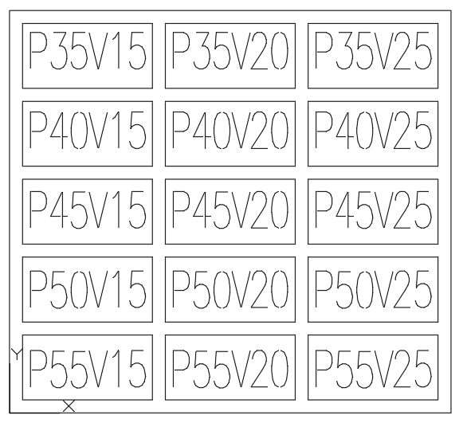 | P52 V25 两遍 |


----


## 气泵/空压机

### 使用指南

1. 使用前插入电源，一定要接地线
2. 检查压力表，如果未达到所需气压，拉起泄压阀上的红色按钮，这个红色按钮就是开关，<b style="color:red">不要使用插拔电源的方法代替气泵开关</b>。若拉起后气泵未工作，可能是气缸内的压力过大未达到气泵的工作压力，拉动泄压阀泄压，直至气泵开始工作
3. 接好气管，打开排气阀
4. 充完气及时按下红色按钮。

### <b style="color:red">注意事项</b>

1. <b style="color:red">由于实验室湿度较大，压缩机内部会积累液态水，应该定期排空，防止空压机生锈。长时间不会使用时，也应排空压缩机内的水（例如去比赛的时候，或者寒暑假等长假）</b> 

2. 使用气钉枪时，<b style="color:red">枪口严禁对准任何人</b>，换钉时，枪口应该朝下，不要对着脚或身体其他部位
3. 气泵工作时，不应擦拭、抚摸机件及调整、紧固和带有压力的部件。
4. 每天使用结束时要切断电源，排空气泵内的气体。在检修前也应切断电源，放出气缸内的气体。
5. 气泵如果出现异响，严禁使用。

## 手动铣刀/砂轮机/砂带机

### 使用指南

1. 如果用铣刀，拧动开关，转速尽可能大一点，不要低速铣玻纤或者木板
2. 如果用的是三合一的那个铣刀（砂带机，铣刀，砂轮机），注意开关的挡位，上面有标签，不要用那个上面的砂轮，拧不紧，用红色的那个砂轮机
3. 如果用砂带机，同样注意挡位，不一样，磨东西不要用力压把砂带压到下面的铁片上面，就轻轻碰到就行，如果磨的时候有明显的降速，拧开关增大转速

